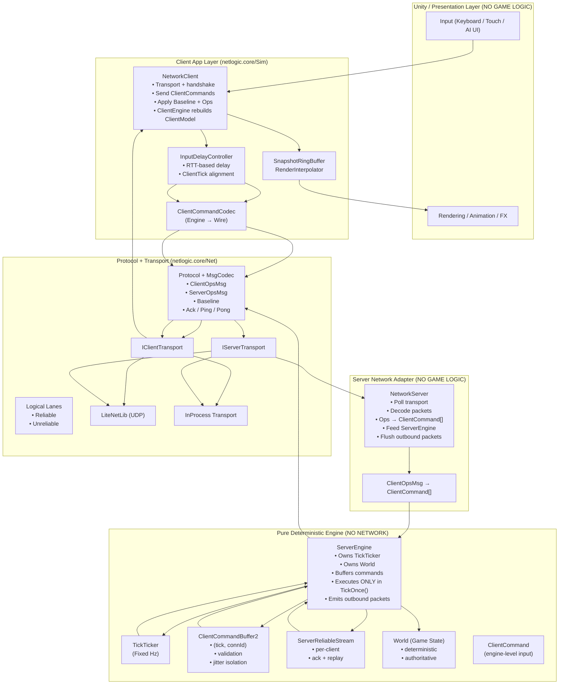

# 🧠 Server-Authoritative Game Engine (Pure C# Core)

This repository contains a **server-authoritative, deterministic, fixed-tick game engine**, written in **pure C#**, with **Unity used only for rendering and presentation**.

The architecture is designed to scale cleanly across:

* ✅ Single-player (client-only)
* ✅ Client-server
* ✅ Multiplayer (authoritative server)
* ✅ Bots / AI players
* ✅ Replay & deterministic testing
* ✅ Future client-side prediction

This is **industry-standard architecture**, not toy code.

---

## 🎯 Core Philosophy

> **ServerEngine is king.**
> **Network is just a pipe.**
> **Commands drive everything.**
> **Ticks are sacred.**

Key guarantees:

* No game state mutation during network polling
* All simulation runs inside a fixed tick
* Clients never send state — only intent
* Engine has zero transport dependency
* Determinism is preserved by construction

---

## 🧱 High-Level Layered Architecture



---

## 🧠 Separation of Concerns (Non-Negotiable)

| Layer            | Responsibility                                              |
| ---------------- | ----------------------------------------------------------- |
| **ServerEngine** | Pure game logic, authoritative state, fixed-tick simulation |
| **NetworkServer** | Network adapter (decode → engine, engine → encode)         |
| **NetworkClient** | Network IO, interpolation, presentation                    |
| **Transport**    | UDP / InProcess, zero game knowledge                        |
| **Protocol**     | Message framing + serialization                             |

❌ No game state mutation during transport polling
✅ All simulation happens in `ServerEngine.TickOnce()`

---

## ⏱ Tick Model

* Fixed tick rate (e.g. **20 Hz**)
* Server owns authoritative tick
* Client sends commands tagged with `clientTick`
* Commands are scheduled and executed on **server tick**

### Command Validation Rules (Casual-Friendly)

| Rule           | Behavior                |
| -------------- | ----------------------- |
| Too late       | Shift to current tick   |
| Too old        | Drop                    |
| Too far future | Clamp or drop           |
| Allowed window | ±2 ticks (configurable) |

This absorbs jitter without breaking determinism.

---

## 🎮 Command-Based Simulation

Clients **never send state**.

They send **intent only**:

```csharp
enum ClientCommandType
{
    MoveBy,
    // CastSpell, UseItem, DiscardCard, ...
}
```

### Flow

```
ClientCommand (engine)
   ↓ encode
ClientOpsMsg (wire)
   ↓ transport
Server
   ↓ decode
ClientCommand[]
   ↓ buffer by tick
TickOnce() executes
```

---

## 🧩 Core Engine Types

### `ClientCommand`

* Engine-level input unit
* Deterministic
* Transport-agnostic

### `ClientCommandBuffer2`

* Indexed by `(tick, connectionId)`
* Validates and schedules commands
* Isolates network jitter from simulation

### `ServerEngine`

* Owns `World`
* Owns `TickTicker`
* Executes commands deterministically
* Produces outbound packets only

Key API:

```csharp
TickOnce();
OnClientConnected();
OnClientHello();
OnClientAck();
OnClientPing();
EnqueueClientCommands();
TryDequeueOutbound();
```

### `ServerReliableStream`

* Per-client reliable op stream
* Ack-based replay
* Used for non-positional state

---

## 🌐 Messaging & Lanes

### Logical Lanes

| Lane         | Purpose                         | Behavior                   |
| ------------ | ------------------------------- | -------------------------- |
| **Reliable** | Events, baseline, container ops | Ordered, acked, replayable |
| **Unreliable**   | Position / continuous state     | Latest-wins, interpolated  |

### State Sync Strategy

**Discrete systems** (cards, inventory, grid):

* Server sends **ops**, not diffs
* Client resolves into animations

**Continuous systems** (position, HP):

* Server sends sampled state
* Client interpolates
* Snaps only on large error

---

## 🧪 Determinism & Recovery

* Baseline snapshot every N ticks
* Used for:

  * Join-in-progress
  * Reconnect
  * Desync recovery

Planned extensions:

* State hash verification
* Record / replay
* Lockstep validation

---

## 🔁 Deployment Modes (Same Engine)

| Mode          | Change                             |
| ------------- | ---------------------------------- |
| Single-player | Local adapter instead of transport |
| Client-server | Current setup                      |
| Multiplayer   | Multiple clients, same engine      |
| Bots          | BotInput → ClientCommand           |
| Replay        | ReplayInput → ClientCommand        |
| Prediction    | Run `ServerEngine` locally         |

**No redesign required.**

---

## 🚀 Why This Architecture

* Matches real shipped games
* Avoids poll-time mutation bugs
* Makes prediction & replay possible
* Keeps engine reusable and testable
* Scales from casual → competitive

Used structurally by:

* RTS lockstep hybrids
* Server-authoritative action games
* Card battlers
* Grid-based multiplayer RPGs

---

## ⛳ TL;DR

* **ServerEngine is king**
* **Network is just a pipe**
* **Commands drive everything**
* **Ticks are sacred**