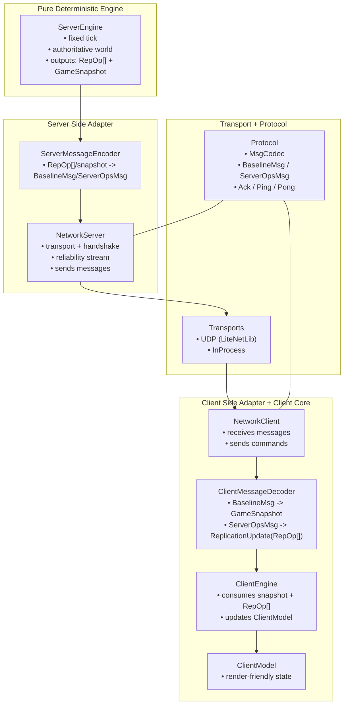

# 🧠 Server-Authoritative Game Engine (Pure C# Core)

This repository implements a **server-authoritative, deterministic, fixed-tick, command-based** multiplayer architecture in **pure C#**, with Unity used only for **rendering/presentation**.

Core promise:

- **No game state mutation during network polling**
- **All simulation runs only inside `ServerEngine.TickOnce()`**
- Clients send **intent only** (commands), never state
- Engine is **transport-agnostic**
- Determinism preserved by construction (tick-driven, buffered commands, controlled IO)

> **ServerEngine is king.**  
> **Network is just a pipe.**  
> **Commands drive everything.**  
> **Ticks are sacred.**

---

## 🧱 High-Level Architecture (Current Ownership Boundaries)

Key idea: the **wire protocol is not the same as the client-facing engine API**.

- Server produces `RepOp[]` + snapshots (sim-facing)
- Server encodes them into protocol messages (wire-facing)
- Client decodes protocol messages back into `GameSnapshot + RepOp[]`
- ClientEngine consumes only `GameSnapshot + RepOp[]` (no wire decoding inside)

⸻

🔥 What changed recently (important)

✅ ClientEngine no longer decodes wire payload bytes

Wire op payload decoding (NetDataReader, opLen parsing) lives in:
	•	Sim/ClientEngine/Protocol/ClientMessageDecoder.cs

ClientEngine now consumes:
	•	GameSnapshot (baseline snapshot)
	•	ReplicationUpdate (envelope containing RepOp[])

This keeps ClientEngine “pure” and makes it reusable for:
	•	local prediction (same input type)
	•	replay pipelines
	•	deterministic tests without wire formats

⸻

📁 Where to look
	•	netlogic.core/Sim/ServerEngine/*
Authoritative simulation and tick loop.
	•	netlogic.core/Sim/NetworkServer/*
Server adapter: transport, handshake, ack/replay, baseline cadence.
	•	netlogic.core/Sim/NetworkClient/*
Client adapter: transport IO + command send + decode pipeline.
	•	netlogic.core/Sim/ClientEngine/*
Client core: ClientEngine, ClientModel.
	•	netlogic.core/Sim/ClientEngine/Protocol/ClientMessageDecoder.cs
Wire messages → snapshot/RepOps decoder.
	•	netlogic.core/Sim/Replication/ReplicationUpdate.cs
Client-facing replication envelope (RepOp[] + tick/hash/seq).

⸻

✅ Non-negotiables
	•	Transport polling must not mutate game state.
	•	Only ServerEngine.TickOnce() mutates World.
	•	Clients never send state. Only commands.
	•	Wire protocol is validated at decode time (protocol version + hash contract).

⸻
